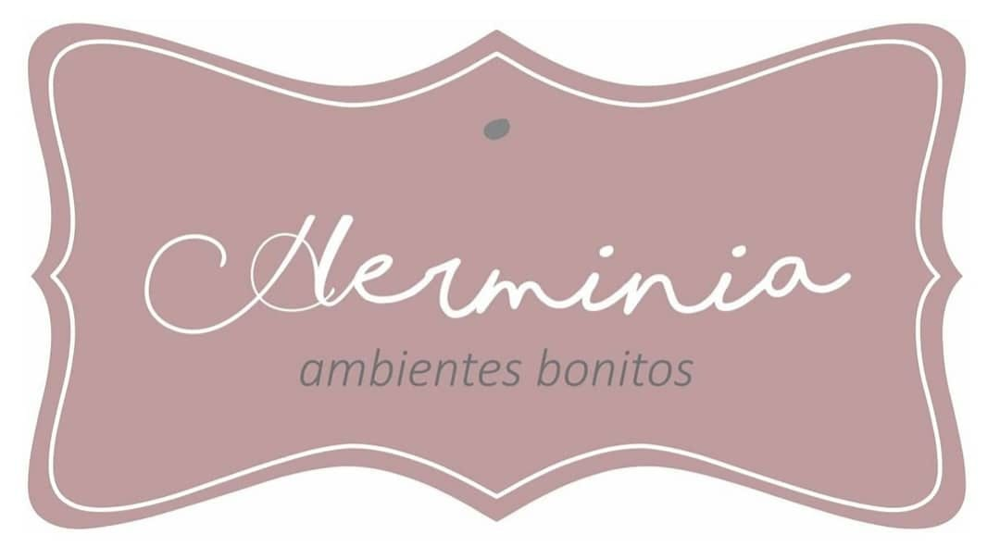

## Ecommerce elaborado: Herminia

#### Este proyecto fue presentado como Instancia Final del Curso de React JS.

#### Las herramientas utilizadas han sido:

- react
- firebase
- yup
- formik
- mui
- react-icons

Creado con ❤ por Pamela Latorre.
